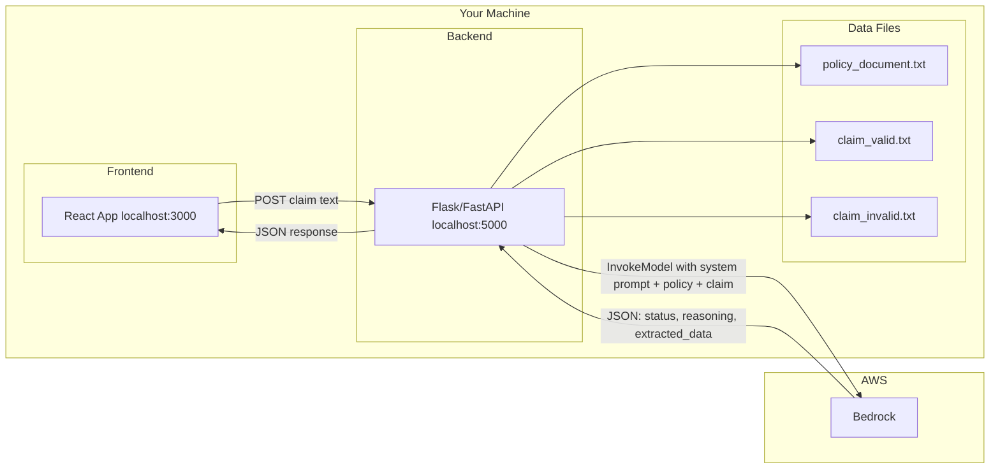
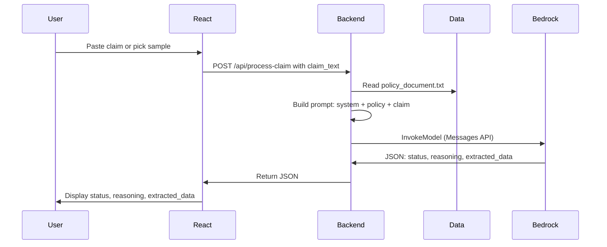

# Local Auto Insurance FNOL — Proof of Concept Plan

## Goal

Build a **local** end-to-end PoC so you can:
1. **Frontend (React, local):** Submit claim text (or pick a sample claim) and **display the result** (claim_id, status, reasoning, extracted_data).
2. **Backend (Python, local):** Read **policy rules** and **claim text**, use a **system prompt** to compare claim vs policy via **Amazon Bedrock**, and return APPROVED / NEEDS_REVIEW / DENIED with reasoning.

No Lambda, no API Gateway in the cloud—**frontend and backend both run on your machine**. Bedrock is still called from the backend (AWS API) for the AI part.

---

## High-Level Architecture (Local)

**Flow in words:**

1. **React (localhost:3000)** — User pastes claim text or selects a sample (Happy Path / Rejection). Clicks “Submit”. Frontend sends claim text to local backend.
2. **Backend (localhost:5000)** — Receives claim text, reads **policy_document.txt** (the “knowledge base” / rules), builds prompt with **system prompt** + policy + claim, calls **Bedrock** (Claude). Parses model JSON (claim_id, status, reasoning, extracted_data). Returns that JSON to frontend.
3. **Frontend** — Displays result: status (APPROVED / NEEDS_REVIEW / DENIED), reasoning, and extracted_data in a simple, readable layout.
4. **Bedrock** — Only cloud service used; called from your local Python backend. No S3/Lambda/API Gateway for this PoC.

---

## Data Files (The “RAG” / Rules and Sample Claims)

All paths below are relative to project root. Backend reads these from disk.

### 1. Policy (The Rules)

**File:** `data/policy_document.txt`

- Represents the **knowledge base** the AI must follow.
- Contents: AUTO INSURANCE POLICY #998877, SwiftCover Auto, effective date, Section A (Collision, Comprehensive, Rental Reimbursement), Section B (Filing requirements, exclusions e.g. 14-day filing, no commercial use without endorsement).
- Backend loads this once per request and passes it into the prompt as `[Policy]`.

### 2. Sample Claim 1 — Happy Path (APPROVED)

**File:** `data/claim_valid.txt`

- Claim ID CL-2024-001, Sarah Jenkins, incident 2024-02-10, filing 2024-02-12 (within 14 days).
- Collision, not drivable, rental requested; police report “No” but damage &lt; $2,000 so not mandatory.
- Expected AI outcome: **APPROVED** (or NEEDS_REVIEW if you want to flag missing police report for &lt; $2k).

### 3. Sample Claim 2 — Rejection (DENIED / NEEDS_REVIEW)

**File:** `data/claim_invalid.txt`

- Claim ID CL-2024-002, Mike Ross, incident 2024-02-01, filing 2024-02-21 (**20 days** → late; policy says 14 days).
- “Dropping off a food delivery” → implies **commercial use** (exclusion without commercial endorsement).
- Expected AI outcome: **DENIED** or **NEEDS_REVIEW** with reasoning (late filing + commercial use).

### 4. System Prompt (The AI Instruction)

**Location:** In backend code (e.g. `backend/prompts.py` or inside `backend/app.py`).

- Instructs the model to act as an expert Insurance Claims Adjuster.
- Steps: (1) Analyze [Claim] — extract Driver Name, Date of Incident, Date of Filing, Estimated Cost, Incident Description. (2) Check [Policy]: timely (14 days)? Police report required if collision &gt; $2,000? Exclusions (e.g. commercial use)? (3) Output JSON: `claim_id`, `status` (APPROVED | NEEDS_REVIEW | DENIED), `reasoning`, `extracted_data`.
- Backend builds one user message: system prompt + “Policy: …” + “Claim: …” and sends to Bedrock (Messages API). Parses JSON from model reply and returns it to frontend.

---

## Component Breakdown

### 1. Frontend (React, local)

- **Location:** `frontend/` (existing Create React App).
- **UI:** Simple layout: textarea or file input for claim text; dropdown or buttons to load sample “Happy Path” or “Rejection” (fills textarea with contents of claim_valid.txt / claim_invalid.txt, or frontend can call `GET /api/samples/claim_valid` to get text).
- **Submit:** `POST /api/process-claim` with body `{ "claim_text": "..." }`. Backend URL e.g. `http://localhost:5000` (env variable).
- **Result:** Display response: `claim_id`, `status`, `reasoning`, `extracted_data` (formatted so it’s easy to read). Optional: color-code status (green APPROVED, red DENIED, yellow NEEDS_REVIEW).
- **No auth** for PoC; CORS allowed from `http://localhost:3000`.

### 2. Backend (Python, local)

- **Location:** `backend/` with e.g. `app.py` (Flask or FastAPI).
- **Endpoints:**
  - `GET /api/health` — Returns OK (for frontend to check backend is up).
  - `GET /api/samples/<name>` — Optional. Returns raw claim text for `claim_valid` or `claim_invalid` (reads from `data/claim_valid.txt`, `data/claim_invalid.txt`).
  - `POST /api/process-claim` — Body: `{ "claim_text": "..." }`. Reads `data/policy_document.txt`, builds prompt (system prompt + policy + claim), calls Bedrock (reuse `claim_processor.bedrock.invoke_claude3_messages` or equivalent), parses JSON from model output, returns `{ "claim_id", "status", "reasoning", "extracted_data" }`.
- **CORS:** Allow `http://localhost:3000` and `Content-Type`.
- **Data path:** Policy and claim files in `data/` (relative to project root or backend root). Backend loads policy once per request from `data/policy_document.txt`.
- **Bedrock:** Use existing `claim_processor` Bedrock helpers; model e.g. Claude 3 Sonnet. Ensure response is parsed as JSON (strip markdown if needed) and validated before returning to frontend.

### 3. Data Files (Local Disk)

- **data/policy_document.txt** — Policy text (SwiftCover Auto, coverage limits, rental reimbursement, 14-day filing, commercial exclusion).
- **data/claim_valid.txt** — Happy path claim (Sarah Jenkins, timely, non-commercial).
- **data/claim_invalid.txt** — Rejection claim (Mike Ross, late filing, food delivery / commercial).

### 4. Processing (Backend + Bedrock)

- **No Lambda:** All logic in local Flask/FastAPI.
- **No S3 for this PoC:** Policy and sample claims are local files. Optional later: allow file upload and pass content as claim_text.
- **RAG:** “RAG” here is **in-context**: full policy text + full claim text in the prompt. No vector store or Knowledge Base for this PoC.
- **System prompt:** Embedded in backend; defines role (Claims Adjuster), steps (extract, check policy, output JSON).
- **Model:** Claude 3 (Messages API) via Bedrock; parse JSON from assistant reply (handle possible markdown code fence).

---

## Suggested Implementation Order

1. **Data files:** Create `data/policy_document.txt`, `data/claim_valid.txt`, `data/claim_invalid.txt` with the exact text from the PoC spec (copy-paste from plan).
2. **Backend:** Create `backend/app.py` (Flask or FastAPI), add system prompt constant, endpoint `POST /api/process-claim` that reads policy + claim text, calls Bedrock, parses JSON, returns result. Optional: `GET /api/samples/<name>`. Enable CORS for localhost:3000.
3. **Frontend:** Update `frontend/src/App.js`: form with textarea for claim text, buttons “Load Happy Path” / “Load Rejection” (set text from samples or fetch from API), “Submit” calls `POST /api/process-claim`, display result (status, reasoning, extracted_data).
4. **Run:** Terminal 1 — `cd backend && python app.py` (or `flask run`). Terminal 2 — `cd frontend && npm start`. Open browser to localhost:3000, submit claim, see result.

---

## Summary Diagram (Local PoC)

---

## What You Already Have

- **frontend/** — React app (Create React App); update to add claim form and result display.
- **claim_processor/** — Bedrock helpers (Messages API); reuse from backend to call Claude 3.
- **main.py, readme.md** — S3/bucket and FNOL case study; optional for later serverless version.

This plan gives you a **local-only** PoC: React frontend + Python backend + policy/claim data files + Bedrock for claim-vs-policy analysis, with no serverless infrastructure. You can later add S3, Lambda, and API Gateway if you move to a deployed solution.
