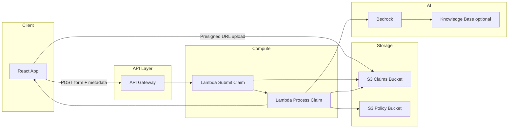
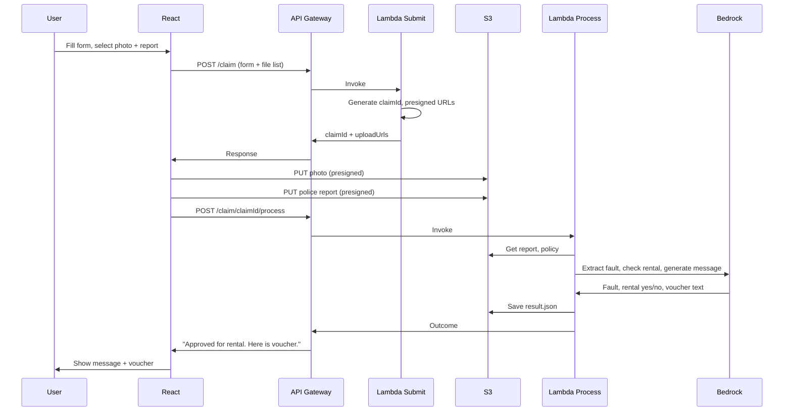

# Serverless Auto Insurance FNOL — Architecture Plan

## Goal

Build an end-to-end serverless solution so a driver can **submit a claim form** and **upload a crash photo + police report**; the system uses **Amazon Bedrock** (and RAG over policy) to analyze fault and rental coverage, then returns an **instant outcome** (e.g. “Claim received. You are approved for a rental car. Here is a voucher.”).

---

## High-Level Architecture

**Flow in words:**

1. **React** — User fills FNOL form (claim ID, driver, incident date, etc.) and selects files: crash photo + police report (PDF/image). Form submit sends JSON to API; uploads go to S3 via presigned URLs.
2. **API Gateway** — REST or HTTP API exposing at least: `POST /claim` (form + metadata), and optionally `POST /claim/upload-url` (returns presigned URL for a given file).
3. **Lambda (Submit)** — Validates input, generates claim ID if needed, returns presigned URLs for photo and police report (or accepts multipart if you prefer). After uploads complete, triggers processing (invoke second Lambda or same Lambda with “process” path).
4. **Lambda (Process)** — Fetches police report and optional photo from S3, pulls policy context from S3 or Knowledge Base, calls Bedrock to: (a) extract fault/incident summary from report, (b) answer “Is rental reimbursement covered?” using policy (RAG or in-context), (c) generate short message + voucher text. Writes result to S3 (e.g. `claims/<claim-id>/result.json`) and/or returns in API response.
5. **S3** — Two buckets or prefixes: (1) **Claims** — uploaded photos, police reports, and processing results by claim ID; (2) **Policy** — policy documents for RAG (or inline in Lambda if very small).
6. **Bedrock** — Foundation model (e.g. Claude) for document understanding and text generation. Optionally **Bedrock Knowledge Base** with policy docs and vector store for RAG; otherwise Lambda retrieves policy from S3 and passes it in the prompt.

---

## Component Breakdown

### 1. Frontend (React)

- **Form:** Claim metadata (e.g. driver name, incident date, policy number, contact). No file binary in form — only filenames and types; actual upload via presigned URL.
- **Upload:** Two file inputs — “Crash photo” and “Police report” (PDF or image). On submit:
  - Call `POST /claim` with form data + list of files to upload (name, type).
  - Backend returns claim ID + presigned URLs per file.
  - Frontend uploads each file with `PUT` to the presigned URL.
  - Frontend calls `POST /claim/<claim-id>/process` (or same endpoint with “process” action) to trigger Bedrock processing.
- **Result:** Poll or wait for sync response showing: “Claim received. You are approved for a rental car. Here is a voucher.” (or not approved + reason). Optionally show fault summary and rental yes/no.
- **Hosting:** Static build (e.g. `build/`) in **S3 + CloudFront** or **Amplify Hosting** for HTTPS and CORS.

**Tech:** React, fetch/axios. Keep API base URL in env (e.g. API Gateway invoke URL). No AWS credentials in frontend; all auth via API Gateway (e.g. IAM or API key if internal only).

### 2. API Layer (API Gateway + Lambda)

- **API Gateway:** REST API or HTTP API (simpler). Routes:
  - `POST /claim` — Body: JSON with form fields + `files: [{ name, type }]`. Lambda returns `claimId` + presigned URLs for each file. Client uploads to S3 using those URLs.
  - `PUT /claim/{claimId}/process` (or `POST /claim` with action “process” after uploads) — Triggers processing Lambda; optionally returns 202 + job id, or synchronous 200 with outcome (if processing is fast enough).
- **CORS:** Enable for your React origin (e.g. CloudFront or Amplify URL). Return `Access-Control-Allow-Origin` and allow `Content-Type`, `Authorization` if used.
- **Lambda (Submit):** Input validation, generate claim ID (e.g. UUID or `CL-YYYY-NNN`), generate S3 presigned URLs (PUT) for `claims/<claimId>/photo.<ext>` and `claims/<claimId>/police-report.<ext>`. Store claim metadata in DynamoDB or in S3 as `claims/<claimId>/metadata.json` (optional). Return JSON with `claimId` and `uploadUrls`.
- **Lambda (Process):** Invoked by second route or by EventBridge/Step Functions after upload. Reads from S3: police report (and optionally photo). If using Knowledge Base: call Bedrock Retrieve + Generate; else: read policy doc from S3, build prompt with report + policy, call Bedrock InvokeModel. Parse model output (fault summary, rental covered yes/no, voucher text). Save result to S3; return same in API response (or return job id and have frontend poll).

**Alternative (simpler for PoC):** Single Lambda behind one `POST /claim` that: accepts form + small files in request (e.g. multipart with size limit), writes to S3, then runs Bedrock in the same invocation and returns outcome. Presigned URL approach scales better and avoids payload limits.

### 3. Storage (S3)

- **Claims bucket (or prefix):**  
  - `claims/<claimId>/metadata.json` — form fields.  
  - `claims/<claimId>/photo.<ext>` — crash photo.  
  - `claims/<claimId>/police-report.pdf` (or .jpg).  
  - `claims/<claimId>/result.json` — Bedrock output (fault, rental approved, message, voucher).
- **Policy bucket (or prefix):** Policy PDFs or text for RAG. Lambda or Knowledge Base reads from here.
- **Lifecycle:** Optional lifecycle rules to move old claims to cheaper storage or expire after N days for PoC.
- **Security:** Bucket policy: only Lambda (and optionally API Gateway if using VPC) can read/write; no public access. Presigned URLs short-lived (e.g. 5–15 min).

You already have a claim-documents style structure in [main.py](main.py); this plan aligns with that (e.g. `claim-documents/` or `claims/<claimId>/`).

### 4. Processing and RAG (Lambda + Bedrock)

- **Document understanding:** Lambda gets police report from S3 (text extraction: use Bedrock with document in prompt if model supports it, or use Textract for PDF → text, then pass text to Bedrock). Prompt: “Extract fault, parties, incident summary from this police report.”
- **Policy / RAG:**  
  - **Option A (simple):** Policy stored as one or few text/PDF files in S3. Lambda downloads, extracts text (or uses Textract), passes “Policy: …” in the same Bedrock prompt: “Given this policy, is Rental Reimbursement included? Yes or no and quote.”
  - **Option B (scalable):** Bedrock Knowledge Base — ingest policy documents into a vector store (e.g. OpenSearch Serverless), use RetrieveAndGenerate API so Bedrock gets only relevant chunks. Lambda calls RetrieveAndGenerate with question “Is rental reimbursement covered for this policy?” and incident context.
- **Response generation:** One more Bedrock call (or same response): “Generate a short message for the driver: claim received; rental approved/not approved; here is the voucher text.” Output stored in `result.json` and returned to client.
- **Model choice:** e.g. `anthropic.claude-v2` or `anthropic.claude-3-sonnet` via Bedrock InvokeModel (or InvokeModelWithResponseStream if you want streaming later). Same for Knowledge Base if used.

### 5. Optional: Step Functions or Async Pattern

- If processing takes > 30 s (Lambda limit), use **Step Functions** or **async invoke:** Lambda returns 202 + `jobId`, processes in background, writes result to S3/DynamoDB; frontend polls `GET /claim/<claimId>/result` until ready.
- For PoC, synchronous Lambda (up to ~30 s) is often enough.

### 6. Security and IAM

- **API Gateway:** No public write without auth for production. Options: API key (internal), IAM (with Cognito Identity Pool for React), or Lambda authorizer (e.g. JWT).
- **Lambda roles:** Least privilege: S3 GetObject/PutObject on claims and policy buckets; Bedrock InvokeModel (and Knowledge Base permissions if used); CloudWatch Logs. No Bedrock or S3 credentials in code; use IAM role.
- **Secrets:** Store nothing in frontend. Lambda can use SSM Parameter Store or env for model IDs / config if needed.

### 7. Infrastructure as Code (IaC)

- **Options:** AWS SAM, AWS CDK, or Serverless Framework.
- **Resources to define:** API Gateway, 2 Lambdas (submit + process), S3 buckets (or prefixes), IAM roles, optional DynamoDB table for claim metadata, optional Bedrock Knowledge Base and index. Environment variables (bucket names, model ID) into Lambdas.
- **Deploy:** Single stack (e.g. `sam deploy` or `cdk deploy`). React build deployed separately (S3 + CloudFront or Amplify).

---

## Suggested Implementation Order

1. **S3 + IAM:** Create claims bucket and policy bucket (or prefixes); bucket policies and Lambda roles.
2. **Lambda (Process) only:** Python: read one police report from S3, call Bedrock (extract summary + “rental covered?” with policy in prompt), write `result.json`. Test with existing [main.py](main.py)-style paths.
3. **Lambda (Submit):** Generate claim ID and presigned URLs; optional write `metadata.json`. No Bedrock yet.
4. **API Gateway:** `POST /claim` → Submit Lambda; `POST /claim/<id>/process` → Process Lambda. Test with Postman/curl.
5. **React:** Form + file pickers; call API for presigned URLs; upload files; call process; display outcome.
6. **RAG upgrade (optional):** Add Bedrock Knowledge Base with policy docs; switch Process Lambda to RetrieveAndGenerate for “rental covered?”.
7. **Hosting + CORS:** Deploy React to S3/CloudFront or Amplify; set CORS on API and bucket; add auth if required.

---

## Summary Diagram (End-to-End)

---

## What You Already Have

- [main.py](main.py): S3 client, bucket create, upload to `claim-documents/<date>/` — reuse same bucket/pattern for claim uploads and processing input.
- [readme.md](readme.md): FNOL case study and learning path — aligns with this architecture (upload photo + report, Bedrock + RAG, instant voucher).

This plan gives you a single, coherent serverless design: React form + upload, API Gateway + Lambda, S3, and Bedrock (with optional Knowledge Base for RAG), so you can implement step by step as an AWS Solutions Architect would.
